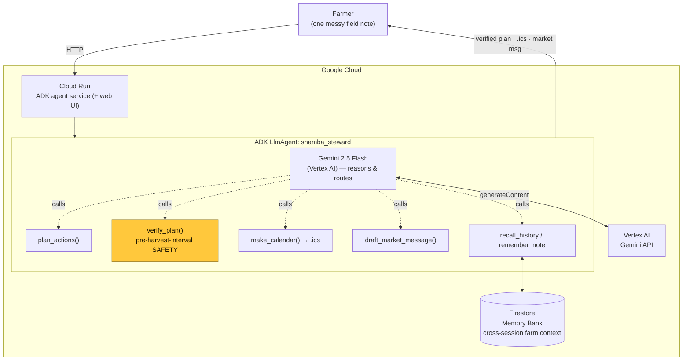

# Shamba Steward — Architecture

## The decoupling (why this scores on Architectural Discipline)

- **Gemini reasons; it does not compute.** The model extracts events and decides *which*
  tool to call and *when*. The load-bearing computations — scheduling and the agrochemical
  **pre-harvest-interval safety check** — are pure, deterministic Python (`tools.py`),
  unit-tested independently of the model. An LLM cannot "hallucinate" a safe plan past the
  verifier.
- **State is external.** Cross-session memory lives in **Firestore**, not in the model
  context, so the agent personalises over weeks and survives restarts. Memory failures
  degrade gracefully (the agent still runs; memory becomes a no-op with an honest note).
- **Runtime scales to zero.** Cloud Run holds no state and idles at zero cost between runs.
- **Credentials.** Gemini is reached through **Vertex AI** using the project's own
  identity (ADC) — no API key in code or image.

## Data flow (one run)

1. Farmer note → Cloud Run → ADK agent.
2. Agent (Gemini) extracts events → `recall_history` (Firestore) → `plan_actions`.
3. `verify_plan` runs the safety checks; violations are surfaced, not hidden.
4. `make_calendar` + `draft_market_message` produce the artifacts.
5. `remember_note` writes the note back to the Memory Bank.
